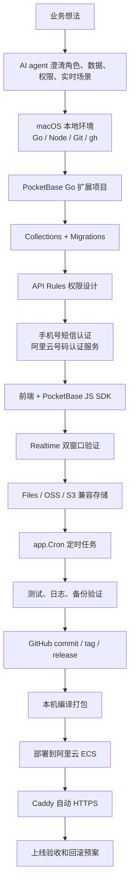
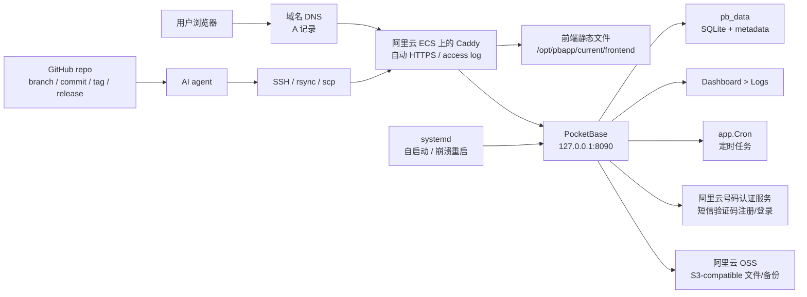
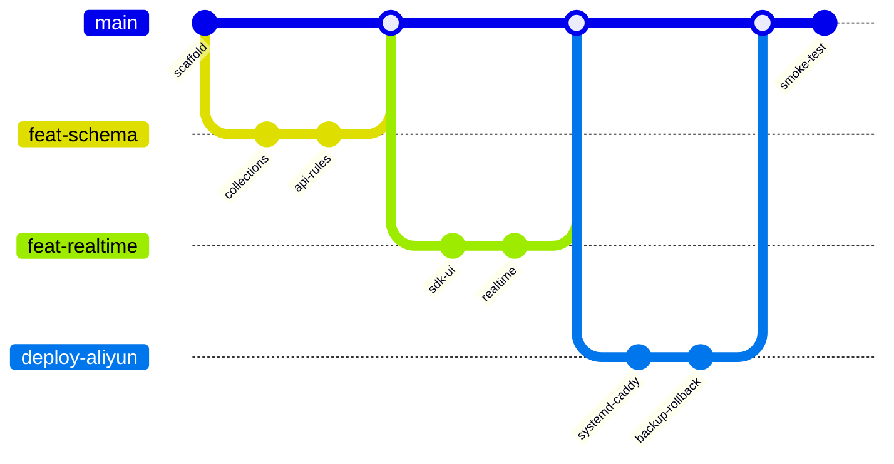
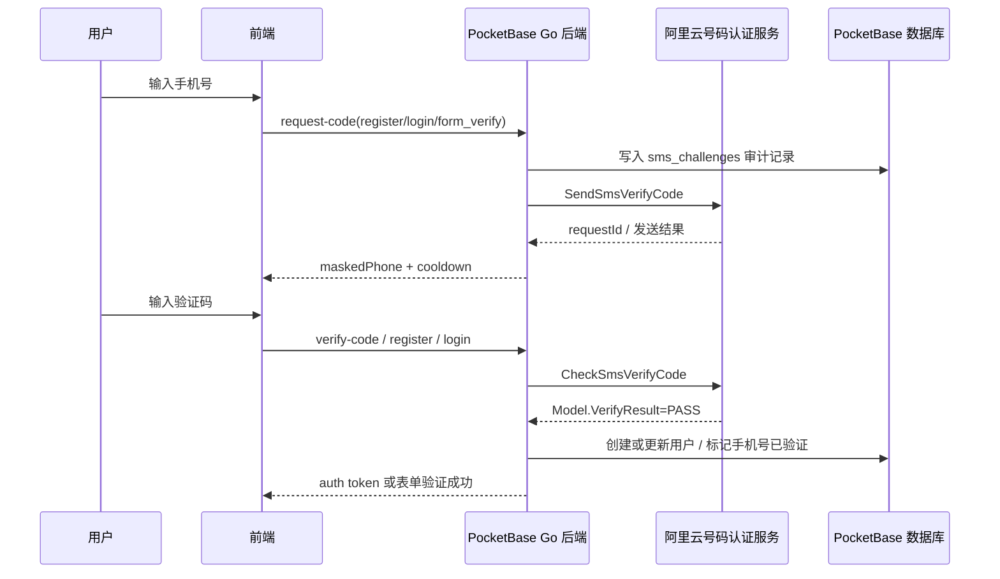
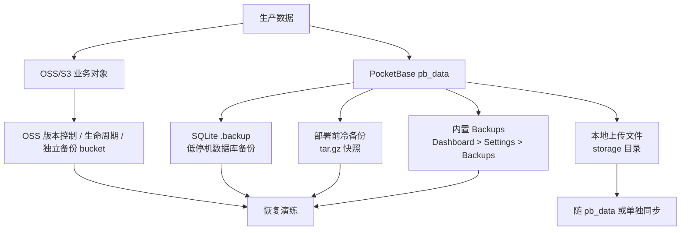

# PocketBase AI MVP Builder

这是一个面向 AI agent 的 Codex Skill，用来指导 agent 基于 [PocketBase](https://pocketbase.io/) 做小型 MVP、内部系统、运营工具、测试工具和少量用户产品的二次开发。

它的目标不是写一份普通教程，而是把一套专业但轻量的系统开发流程交给 AI agent：从本地 macOS 环境、PocketBase Go 扩展、权限规则、手机号短信认证、realtime、文件存储、定时任务、GitHub 版本管理，到阿里云 ECS、Caddy HTTPS、日志、备份、回滚和首次 superuser 设置。

## 适合谁

- 没有开发经验，但希望用 AI agent 做内部系统的设计师、运营、测试同学。
- 想用 PocketBase 快速完成 MVP 的产品/业务同学。
- 想给非工程团队建立标准开发和上线流程的工程师。
- 想把 PocketBase 作为轻量后端框架进行二次开发的个人开发者。

## Skill 覆盖能力

- macOS 本地开发环境：Go、Node.js、Git、GitHub CLI、国内 Go/NPM 代理。
- PocketBase Go 扩展：`main.go`、migrations、hooks、custom routes、commands。
- 数据建模：collections、auth collections、relations、status、audit fields。
- 权限系统：API rules、owner-only、role-based、匿名/登录/管理员测试。
- 手机号短信认证：阿里云号码认证服务、短信验证码注册/登录、绑定手机号、强身份表单验证。
- Realtime：前后端实时同步、双窗口验证、事件合并。
- 文件存储：PocketBase file field、本地 `pb_data`、S3-compatible object storage。
- 阿里云 OSS：AWS S3 兼容 endpoint、RAM AccessKey、独立备份 bucket 建议。
- 定时任务：PocketBase 内置 `app.Cron()`、`Dashboard > Settings > Crons` 验证。
- 数据库备份：PocketBase 内置 Backups、冷备份、SQLite `.backup`、恢复演练。
- GitHub 工作流：`gh` 创建仓库、分支、commit、tag、release。
- 阿里云 ECS 部署：本机编译、`rsync` 上传、systemd 自启动、Caddy 免费 HTTPS。
- 运维：日志查看、Caddy access log、systemd/journald、回滚、打包发布脚本。
- 首次上线：superuser 创建、SMTP、rate limiter、superuser IP whitelist、MFA 提醒。

## 文件结构

```text
pocketbase-ai-mvp-builder/
  SKILL.md
  agents/
    openai.yaml
  references/
    agent-prompt-template.md
    aliyun-deployment-github-caddy.md
    pocketbase-patterns.md
```

## 快速安装

把这个仓库克隆到本机：

```bash
git clone https://github.com/charlescui/pocketbase-ai-mvp-builder.git
```

如果你使用 Codex 的本地 skills 目录，可以复制整个 skill 文件夹：

```bash
mkdir -p ~/.codex/skills
cp -R pocketbase-ai-mvp-builder ~/.codex/skills/
```

然后在新任务里对 agent 说：

```text
请使用 pocketbase-ai-mvp-builder 这个 skill，帮我基于 PocketBase 开发一个小型内部系统。
```

更完整的课堂提示词在：

- [references/agent-prompt-template.md](references/agent-prompt-template.md)

## 推荐开发闭环



## 推荐部署架构



## GitHub 版本管理流程



建议 agent 主动 commit 的时机：

- 项目脚手架能启动后。
- collections、migrations、API rules 跑通后。
- 登录、权限、realtime、文件上传完成后。
- `app.Cron()` 定时任务完成并验证后。
- 部署脚本、Caddyfile、systemd service、备份/回滚脚本完成后。
- 远程 smoke test 通过后打 tag，例如 `v0.1.0`。

## 手机号短信认证流程

新系统面向真实用户时，手机号通常是最基础的身份能力。这个 skill 要求 agent 把短信验证码注册/登录做在 PocketBase Go 后端，并使用阿里云号码认证服务。

手机号不是唯一登录方式。PocketBase 仍然可以支持邮箱密码、管理员邀请，以及 Google、GitHub 等 OAuth2 登录；但在很多中国本地业务系统里，手机号是最重要的业务身份锚点，用于确认“这个人真的拥有这个号码”，也用于注册、登录、绑定账号、找回密码和强身份表单。

默认推荐使用阿里云生成并核验验证码：PocketBase 调用 `SendSmsVerifyCode`，模板参数使用动态占位 `{"code":"##code##","min":"5"}`，同时设置 `CodeType=1`、`CodeLength=6`、`ValidTime=300`、`Interval=60` 这类验证码生成和频控参数；用户输入验证码后，PocketBase 再调用 `CheckSmsVerifyCode`，并且只有 `Model.VerifyResult=PASS` 才算通过。

如果改成 PocketBase 自己生成验证码、只用阿里云发送短信，也可以，但那时阿里云只是短信通道，PocketBase 必须自己完成验证码哈希存储、过期、错误次数、频控、消费和审计。

课堂默认使用以下已通过审核的阿里云签名和模板。agent 应把这些配置做进 PocketBase 后台的 locked/server-only 配置表，例如 `system_sms_configs`、`system_sms_signatures`、`system_sms_templates`，让管理员可以维护业务 purpose、签名、模板、有效期和频控参数。

| 业务场景 | 签名 | 模板 CODE | 模板 |
| --- | --- | --- | --- |
| 注册/登录/通用表单验证 | 速通互联验证码 | `100001` | 登录/注册模板 |
| 修改绑定手机号 | 速通互联验证码 | `100002` | 修改绑定手机号模板 |
| 重置密码 | 速通互联验证码 | `100003` | 重置密码模板 |
| 绑定新手机号 | 速通互联验证码 | `100004` | 绑定新手机号模板 |
| 验证绑定手机号/敏感操作 | 速通互联验证码 | `100005` | 验证绑定手机号模板 |

可用签名还包括：`云渚科技验证平台`、`云渚科技验证服务`、`速通互联验证码`、`速通互联验证平台`、`速通互联验证服务`，当前均为通过状态。阿里云 AccessKey/Secret 不应作为普通配置表明文字段，默认放在服务端环境变量、ECS RAM 角色或加密后的服务端 secret 中。

完整模板配置：

| 模板名称 | 模板 CODE | 模板内容 |
| --- | --- | --- |
| 登录/注册模板 | `100001` | 您的验证码为`${code}`。尊敬的客户，以上验证码`${min}`分钟内有效，请注意保密，切勿告知他人。 |
| 修改绑定手机号模板 | `100002` | 尊敬的客户，您正在进行修改手机号操作，您的验证码为`${code}`。以上验证码`${min}`分钟内有效，请注意保密，切勿告知他人。 |
| 重置密码模板 | `100003` | 尊敬的客户，您正在进行重置密码操作，您的验证码为`${code}`。以上验证码`${min}`分钟内有效，请注意保密，切勿告知他人。 |
| 绑定新手机号模板 | `100004` | 尊敬的客户，您正在进行绑定手机号操作，您的验证码为`${code}`。以上验证码`${min}`分钟内有效，请注意保密，切勿告知他人。 |
| 验证绑定手机号模板 | `100005` | 尊敬的客户，您正在验证绑定手机号操作，您的验证码为`${code}`。以上验证码`${min}`分钟内有效，请注意保密，切勿告知他人。 |



关键原则：

- AccessKey 只在服务端。
- 验证码不能明文入库或写日志。
- `phone_verified` 只能由后端写入。
- 默认推荐 `SendSmsVerifyCode` + `CheckSmsVerifyCode` 成套使用。
- 生产环境不要让阿里云接口把验证码返回给后端响应或日志。
- 不暴露手机号是否已注册。
- 按手机号、IP、purpose 做限流。
- 表单手机号如果有强身份要求，也必须经过短信校验。

## 数据备份原则

PocketBase 的数据安全不是“最后再说”的事。这个 skill 要求 agent 在上线时明确交付备份和恢复路径。



重要提醒：

- `Dashboard > Settings > Backups` 是非工程同学最容易理解的备份入口。
- 备份建议使用独立 OSS bucket，不要和业务上传文件混在一起。
- 每次运行 migration 前必须先备份。
- 如果启用了 settings encryption，要单独保存 `PB_ENCRYPTION_KEY`。
- 备份文件可能包含用户数据和系统密钥，不能提交到 GitHub。

## PocketBase 定时任务

PocketBase 已内置 jobs scheduling。用户提出“每天生成报表”“每小时同步数据”“定时清理过期记录”“自动提醒”“检查备份是否存在”这类需求时，agent 应优先使用 `app.Cron()`。

```go
app.Cron().MustAdd("daily-summary", "0 9 * * *", func() {
    app.Logger().Info("daily-summary job started")
    // query records, generate report, send notification
})
```

验收要求：

- 在 `Dashboard > Settings > Crons` 能看到任务。
- 能手动触发任务。
- `Dashboard > Logs` 和 `journalctl -u pbapp` 能看到任务日志。
- 任务失败时记录错误，不让整个服务崩溃。
- 不要随意 `RemoveAll()` 或 `Stop()` app 级 cron，PocketBase 系统任务也依赖它。

## 首次上线必做

第一次部署 PocketBase 后，必须尽快设置 superuser。PocketBase 官方称后台超级管理员为 `superuser`，课堂里常说的 superadmin 通常就是它。

常用命令：

```bash
sudo -u pocketbase /opt/pbapp/current/pbapp superuser create ADMIN_EMAIL STRONG_TEMP_PASSWORD --dir=/var/lib/pocketbase/pb_data
```

agent 必须提醒用户：

- 登录 `https://你的域名/_/` 后立刻更换强密码。
- 不要把 superuser 密码、AccessKey、SSH key、`.env`、`pb_data` 提交到 GitHub。
- 配置 SMTP，否则密码重置、验证邮件、MFA 邮件可能不可用。
- 开启 rate limiter。
- 配置 superuser IP whitelist。
- 可选启用 superuser MFA/OTP。
- 检查所有 public API rules，确认敏感数据没有公开。

## 常用参考

- [SKILL.md](SKILL.md)：agent 触发后最先读取的主工作流。
- [课堂提示词模板](references/agent-prompt-template.md)：给学生直接复制给 agent 的提示词。
- [PocketBase 实战模式参考](references/pocketbase-patterns.md)：数据建模、权限、realtime、文件、定时任务、备份、日志。
- [手机号短信认证与阿里云号码认证服务](references/phone-sms-auth-aliyun.md)：注册、登录、绑定手机号、强身份表单验证。
- [阿里云部署 + GitHub CLI + Caddy 参考](references/aliyun-deployment-github-caddy.md)：ECS、SSH、Caddy、systemd、日志、superuser、备份恢复、阿里云 OSS。

## 官方资料

- [PocketBase Docs](https://pocketbase.io/docs/)
- [PocketBase Go overview](https://pocketbase.io/docs/go-overview/)
- [PocketBase Realtime API](https://pocketbase.io/docs/api-realtime/)
- [PocketBase API rules](https://pocketbase.io/docs/api-rules-and-filters/)
- [PocketBase Jobs scheduling](https://pocketbase.io/docs/go-jobs-scheduling/)
- [PocketBase Going to production](https://pocketbase.io/docs/going-to-production/)
- [Caddy Automatic HTTPS](https://caddyserver.com/docs/automatic-https)
- [GitHub CLI Manual](https://cli.github.com/manual/)
- [阿里云 OSS：使用 AWS SDK 访问 OSS](https://help.aliyun.com/zh/oss/developer-reference/use-aws-sdks-to-access-oss)
- [阿里云号码认证服务：短信认证服务新手指南](https://help.aliyun.com/zh/pnvs/getting-started/sms-authentication-service-novice-guide)
- [阿里云号码认证服务：SendSmsVerifyCode](https://help.aliyun.com/zh/pnvs/developer-reference/api-dypnsapi-2017-05-25-sendsmsverifycode)
- [阿里云号码认证服务：CheckSmsVerifyCode](https://help.aliyun.com/zh/pnvs/developer-reference/api-dypnsapi-2017-05-25-checksmsverifycode)

## 安全边界

这个仓库只包含 skill 文档和示例配置，不应包含真实密钥、真实服务器地址、真实 AccessKey、真实 superuser 密码、生产数据库或上传文件。

当 agent 根据这个 skill 操作真实服务器时，涉及删除数据、恢复备份、重装服务、修改防火墙、关闭安全策略、重启服务器等动作，必须先向用户确认。
