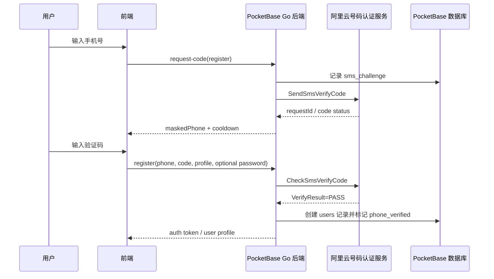

# 手机号短信认证与阿里云号码认证服务

## 目录

- [目标](#目标)
- [适用场景](#适用场景)
- [阿里云准备](#阿里云准备)
- [两种验证码模式](#两种验证码模式)
- [PocketBase 数据模型](#pocketbase-数据模型)
- [后端接口设计](#后端接口设计)
- [注册和登录流程](#注册和登录流程)
- [高可信表单验证](#高可信表单验证)
- [安全规则](#安全规则)
- [前端体验](#前端体验)
- [测试清单](#测试清单)

## 目标

在基于 PocketBase 二次开发的新系统中，把手机号作为真实用户身份的基础能力。手机号不能只是一个普通输入框；凡是用于注册、登录、账号绑定、找回账号、提交强身份表单的手机号，都必须经过短信验证码或等价能力验证。

默认方案：使用阿里云号码认证服务的短信认证 API。

- 发送验证码：`SendSmsVerifyCode`
- 校验验证码：`CheckSmsVerifyCode`

关键约束：

- 短信发送和校验必须在 PocketBase 后端完成。
- 前端只提交手机号、验证码和业务目的，不能接触阿里云 AccessKey。
- 不要自己在前端生成验证码。
- 不要把验证码明文写入数据库或日志。
- 阿里云校验成功不能只看 HTTP 成功，也不能只看 `Code=OK`；当前文档中还要确认 `Model.VerifyResult = PASS`。
- 生产环境不要把验证码返回到 API 响应、数据库或日志。

## 适用场景

优先使用手机号短信认证的场景：

- 新用户注册账号。
- 用户用手机号 + 验证码登录。
- 用户注册后选择设置密码，之后支持手机号 + 密码登录。
- 用户绑定或更换手机号。
- 用户提交报名、申请、预约、审批、报修、投诉等表单时，系统必须确认这个手机号属于提交人。
- 找回密码、敏感操作二次验证。

不适合只靠短信认证的场景：

- 高价值金融、支付、强合规业务，需要更高等级认证。
- 海外用户为主，短信服务可达性不稳定。
- 高频机器通知，应该使用消息队列、站内通知、邮件或专门短信通知服务。

## 阿里云准备

Agent 在实现前要引导用户准备：

- 开通阿里云号码认证服务/短信认证服务。
- 完成实名认证、服务开通、签名和模板配置。
- 准备短信签名 `SignName`。
- 准备短信模板 `TemplateCode`。
- 准备业务方案/方案名称 `SchemeName`，如果当前控制台和 API 要求该参数。
- 使用 RAM 用户创建 AccessKey，权限最小化，只允许调用相关短信认证 API。
- 确认费用、频控、模板审核状态和短信送达范围。

推荐环境变量：

```bash
ALIBABA_CLOUD_ACCESS_KEY_ID=replace-me
ALIBABA_CLOUD_ACCESS_KEY_SECRET=replace-me
ALIYUN_PNVS_ENDPOINT=dypnsapi.aliyuncs.com
ALIYUN_SMS_SCHEME_NAME=replace-me
ALIYUN_SMS_SIGN_NAME=replace-me
ALIYUN_SMS_TEMPLATE_CODE=replace-me
SMS_CODE_TTL_SECONDS=300
SMS_CODE_LENGTH=6
ALIYUN_SMS_CODE_TYPE=1
SMS_CODE_COOLDOWN_SECONDS=60
SMS_MAX_ATTEMPTS=5
SMS_MAX_SENDS_PER_PHONE_PER_DAY=10
SMS_MAX_SENDS_PER_IP_PER_HOUR=20
```

如果官方 SDK、endpoint、参数名在新版本中变化，先以阿里云 OpenAPI Explorer 和当前文档为准。

## 两种验证码模式

实现前必须先选清楚验证码模式。不要把两种模式混在一起。

### 推荐：阿里云生成验证码，阿里云核验验证码

这是本 skill 默认推荐模式，适合“注册/登录/绑定手机号/强身份表单”。

流程：

1. PocketBase 后端调用 `SendSmsVerifyCode`。
2. `TemplateParam` 使用阿里云动态验证码占位，例如：

```json
{"code":"##code##","min":"5"}
```

3. 设置验证码生成参数。使用占位符时 `CodeType` 必填，推荐 `CodeType=1`、`CodeLength=6`、`ValidTime=300`、`Interval=60`。
4. 阿里云生成验证码并发送短信。
5. 用户输入验证码。
6. PocketBase 后端调用 `CheckSmsVerifyCode`。
7. 只有 `Model.VerifyResult = PASS` 才标记手机号已验证。

这个模式的好处：

- PocketBase 不需要生成和保存验证码。
- 不需要自己比对验证码明文。
- 验证码生命周期和校验由阿里云短信认证服务承接。
- 后端只保存 challenge/audit/attempt 状态即可。

### 可选：PocketBase 自己生成验证码，只用阿里云发送短信

这个模式也能实现，但此时阿里云只是短信发送通道，不再负责验证码核验。只有在业务明确要求自管验证码，或者当前阿里云模板/API 不适合动态验证码时才使用。

流程：

1. PocketBase 后端生成随机验证码。
2. PocketBase 只保存验证码哈希，不保存明文。
3. PocketBase 调用短信发送能力，把具体验证码填入模板。
4. 用户输入验证码。
5. PocketBase 后端自行比对验证码哈希、TTL、attempts、purpose、phone、challenge。
6. 验证成功后消费 challenge 并标记手机号已验证。

自管验证码必须额外实现：

- 加密安全随机数。
- 验证码哈希存储。
- 5 分钟左右 TTL。
- 同手机号、同 IP、同 purpose 频控。
- 错误次数上限。
- 消费后不可复用。
- 重放攻击防护。
- 日志脱敏。

注意：如果把具体验证码值传给阿里云模板，例如 `{"code":"123456"}`，就不要再调用 `CheckSmsVerifyCode` 期待阿里云帮你核验。此时核验责任在 PocketBase。

## PocketBase 数据模型

在 auth collection，例如 `users`，增加字段：

```text
phone_e164              text, unique, optional before verification
phone_country_code      text, default "86"
phone_national          text, unique where present, e.g. 13800138000
phone_verified          bool
phone_verified_at       date
phone_login_enabled     bool
password_login_enabled  bool
last_phone_login_at     date
```

建议创建 server-only collection：`sms_challenges`。所有 API rules 设为 locked/null，不允许客户端直接 list/view/create/update/delete。

```text
purpose             select: register/login/bind_phone/change_phone/form_verify/password_reset
phone_e164          text
phone_hash          text
out_id              text, unique
aliyun_request_id   text
scheme_name         text
ip_hash             text
user_agent_hash     text
status              select: sent/verified/failed/expired/consumed
attempts            number
expires_at          date
verified_at         date
consumed_at         date
related_user        relation -> users, optional
related_record      text, optional
error_code          text, optional
created             date
updated             date
```

推荐模式下不要存储短信验证码明文，也不需要存储验证码哈希。需要排障时记录 `out_id`、阿里云 request id、错误码、masked phone 或 hash。自管验证码模式才允许保存验证码哈希字段，且必须设置 TTL 和消费状态。

对高可信表单，业务 collection 增加：

```text
contact_phone_e164       text
contact_phone_verified   bool
phone_verified_at        date
phone_verification_id    text or relation
```

## 后端接口设计

推荐自定义 Go routes：

```text
POST /api/phone/request-code
POST /api/phone/verify-code
POST /api/auth/phone/register
POST /api/auth/phone/login
POST /api/account/phone/bind
POST /api/forms/:collection/:id/verify-phone
```

### request-code

输入：

```json
{
  "phone": "13800138000",
  "countryCode": "86",
  "purpose": "register"
}
```

后端步骤：

1. 校验手机号格式。中国大陆手机号建议规范成 `+8613800138000` 和 `13800138000` 两个字段。
2. 检查 purpose 是否在允许列表。
3. 做频控：同手机号 cooldown、每日上限、同 IP 小时上限、失败次数上限。
4. 生成 `out_id`，写入 `sms_challenges`。
5. 调用阿里云 `SendSmsVerifyCode`。
6. 默认使用阿里云动态生成验证码，`TemplateParam` 使用类似：

```json
{"code":"##code##","min":"5"}
```

7. 同时设置 `CodeType=1`、`CodeLength=6`、`ValidTime=300`、`Interval=60`。使用 `##code##` 占位时 `CodeType` 必填；如需重复发送策略，可设置 `DuplicatePolicy=1` 让新验证码覆盖旧验证码。
8. 生产环境不要启用把验证码返回给调用方的调试参数；如果 SDK 暴露 `ReturnVerifyCode`，生产环境必须保持关闭。
9. 返回统一响应，例如：

```json
{
  "ok": true,
  "challengeId": "public-safe-id-or-out-id",
  "maskedPhone": "138****8000",
  "cooldownSeconds": 60
}
```

不要告诉前端“这个手机号是否已经注册”。注册/登录场景都返回统一话术，防止枚举账号。

### verify-code

输入：

```json
{
  "phone": "13800138000",
  "countryCode": "86",
  "purpose": "register",
  "code": "123456",
  "challengeId": "..."
}
```

后端步骤：

1. 查找未过期、未消费、purpose 匹配的 challenge。
2. 检查 attempts 上限。
3. 推荐模式下调用阿里云 `CheckSmsVerifyCode`；自管验证码模式下改为 PocketBase 自己比对验证码哈希。
4. 推荐模式下只有在 API 成功且 `Model.VerifyResult = PASS` 时认为成功；自管验证码模式下只有本地哈希、TTL、attempts、purpose、phone 都通过才认为成功。
5. 标记 challenge `verified` 或 `failed`，记录 attempts、error code、verified_at。
6. 对注册/登录流程，继续创建用户或签发 auth token。
7. 对表单流程，给目标记录打上 phone verified 标记。

## 注册和登录流程

### 手机号注册，注册后可选设置密码



规则：

- 验证码通过后才能创建用户。
- 如果手机号已经存在，不要提示“手机号已注册”，可以引导用户登录或返回统一失败文案。
- 如果允许密码登录，密码只能在手机号验证后设置。
- 如果不允许密码登录，后续登录继续使用短信验证码。

### 手机号验证码登录

1. 用户输入手机号。
2. 后端发送验证码，不暴露账号是否存在。
3. 用户输入验证码。
4. 后端校验通过后查找用户。
5. 如果用户存在，签发 PocketBase auth token。
6. 如果产品允许自动注册，可以创建用户；否则提示用户完成注册。

### 手机号 + 密码登录

PocketBase 默认没有“手机号字段直接登录”的通用假设，agent 应用自定义后端 endpoint 实现：

1. 用户输入手机号和密码。
2. 后端按 normalized phone 查找用户。
3. 使用当前 PocketBase 版本推荐的 auth/password 校验方式验证密码。
4. 只允许 `phone_verified = true` 且 `password_login_enabled = true` 的用户登录。
5. 成功后签发 auth token。

具体 auth token 生成和密码校验 API 会随 PocketBase 版本演进，编码前查当前官方 Go API 和项目示例，不要凭旧版本硬写。

### 绑定或更换手机号

- 必须要求当前用户已登录。
- 绑定新手机号前发验证码到新手机号。
- 验证通过后再写入 `users.phone_*` 字段。
- 如果手机号已被其他账号绑定，拒绝并记录审计日志。
- 更换手机号属于敏感操作，可要求原手机号、密码或管理员审核。

## 高可信表单验证

对“报名、预约、投诉、审批、报修、领取资格”等表单，如果手机号决定身份或后续联系，不能允许用户随便填别人的号码。

推荐流程：

1. 用户填写表单和手机号。
2. 前端调用 `request-code`，purpose 使用 `form_verify`。
3. 用户输入验证码。
4. 后端 `CheckSmsVerifyCode` 通过后，把手机号和验证时间写入表单记录。
5. 表单提交、审核、导出时使用 verified phone 字段。

表单 collection 的 create/update rule 不能允许客户端直接设置：

```text
contact_phone_verified
phone_verified_at
phone_verification_id
```

这些字段只能由后端 route 或 hook 写入。

## 安全规则

必须做：

- AccessKey 只在服务端环境变量或安全配置里。
- 所有 SMS API route 都加 rate limit。
- 同手机号发送间隔至少 60 秒。
- 验证码有效期建议 5 分钟。
- 每个 challenge 尝试次数有限，例如 5 次。
- 记录 IP hash、User-Agent hash、purpose、out_id。
- 日志只记录 masked phone 或 hash。
- 统一错误文案，防止手机号枚举。
- 验证成功后 challenge 只能消费一次。
- 不允许前端设置 `phone_verified`、`phone_verified_at`。
- 提交表单时，后端必须检查 verification purpose 和目标记录是否匹配。

建议做：

- 失败过多后要求图形验证码或人工审核。
- 高风险操作要求二次验证。
- 对异常发送量设置告警。
- 定时任务检查短信异常、重复失败、备份缺失。
- 给管理员后台提供短信验证审计视图，但隐藏完整手机号。

## 前端体验

注册/登录页面建议：

- 默认展示手机号登录/注册。
- 按钮文字：获取验证码、重新发送、验证并登录、验证并注册。
- 显示倒计时，例如 60 秒后重发。
- 验证码输入框支持 6 位数字。
- 错误文案不要暴露手机号是否存在。
- 注册后可以提示“设置密码，下次也可用手机号+密码登录”。
- 如果短信未收到，提供“检查手机号/稍后重试/联系管理员”。

高可信表单建议：

- 手机号输入框旁边放“验证手机号”。
- 验证成功后显示“已验证”，锁定手机号或要求重新验证才能修改。
- 表单提交前检查 `phone_verified` 状态。

## 测试清单

本地和测试环境至少覆盖：

- 正常注册：发送验证码、校验、创建用户、phone_verified=true。
- 正常登录：已注册手机号验证码登录。
- 可选密码登录：手机号验证后设置密码，使用手机号+密码登录。
- 重复注册：同一手机号不能创建多个账号。
- 错误验证码：attempts 增加，不签发 token。
- 过期验证码：拒绝。
- 已消费验证码：不能重复使用。
- 高频发送：同手机号、同 IP 被限制。
- 绑定手机号：登录用户绑定新手机号。
- 更换手机号：旧手机号不能被冒用。
- 表单验证：未验证手机号不能提交强身份表单。
- API rules：客户端不能直接写 `phone_verified`。
- 日志：不出现完整手机号、验证码、AccessKey。
- 部署：环境变量存在，systemd 不打印 secret。
- 阿里云错误：模板未审核、签名错误、余额不足、频控触发时有清晰日志和用户友好提示。

上线交付时必须告诉用户：

- 阿里云号码认证服务控制台入口和当前签名/模板/方案名称。
- AccessKey 存放位置，且确认未进 GitHub。
- 手机号注册/登录的后端 endpoint。
- 短信发送频控策略。
- 如何在 Dashboard/Logs 中排查短信问题。
- 如何关闭短信注册或切换为管理员邀请制。
